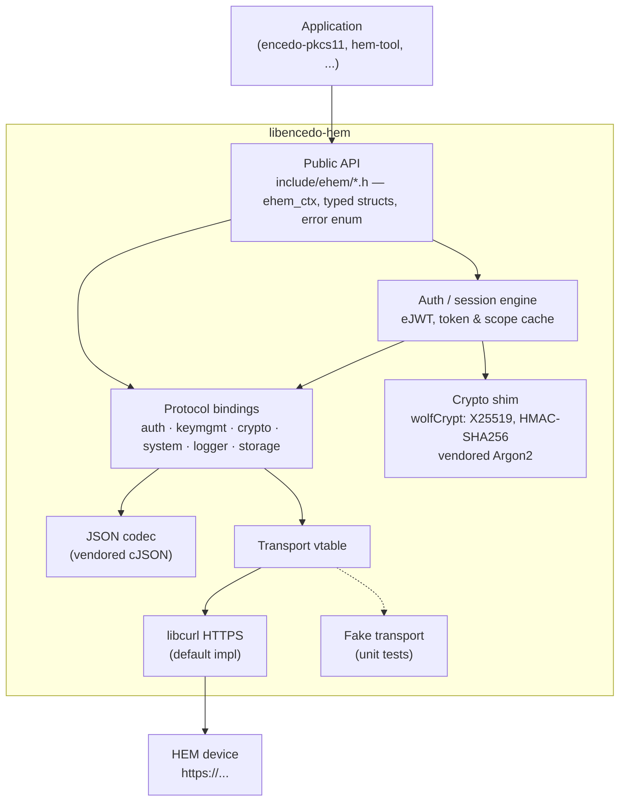
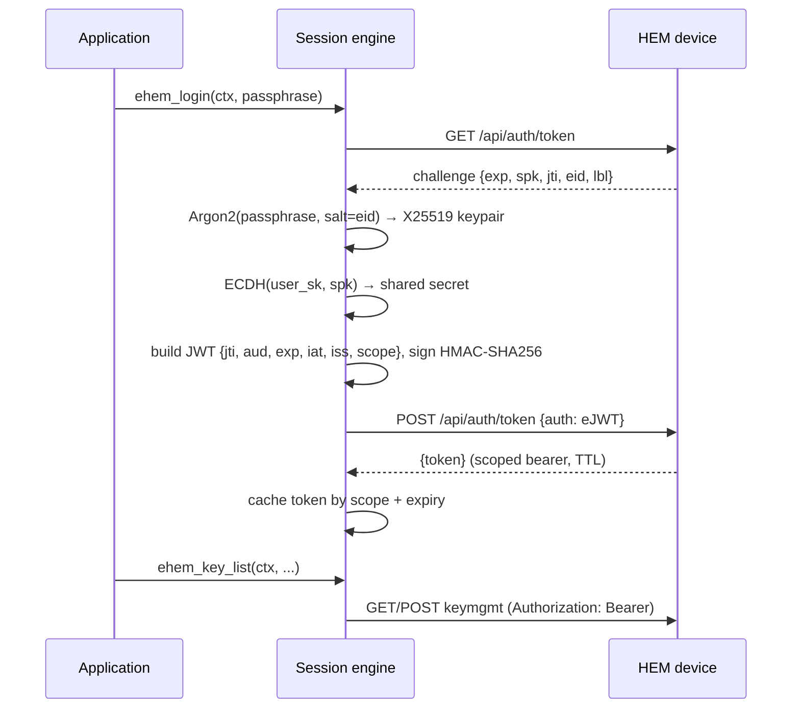

# encedo-hem-c-api — Architecture

This document defines **what** is being built and the decisions that shape
it. How the work is tracked — requirements, steps, traceability, change
management — is defined in
[REQUIREMENTS-MANAGEMENT.md](REQUIREMENTS-MANAGEMENT.md).

## [TLDR]

**Purpose:** A portable C client library (the "Encedo HEM C SDK") that gives
native applications — first among them the encedo-pkcs11 module — complete,
typed access to the Encedo HEM network cryptographic device over its
REST/HTTPS API, from a simple connection test (MVP) up to full coverage of
the encedo-hem-api-doc spec.

**Core components:**

- **Public API** (`include/ehem/*.h`) — context-based (`ehem_ctx`), no
  global state; typed C structs in/out; one error enum whose values
  distinguish every condition the PKCS#11 backend must map (user rejection
  vs. confirm timeout vs. expired credential vs. scope denied vs. network
  failure vs. device unreachable).
- **Auth / session engine** — implements the eJWT challenge–response:
  GET challenge → derive user key from passphrase (Argon2, `eid` as salt,
  parameters as used by Encedo Manager — the authoritative reference for
  the auth flow) → X25519 ECDH against the device's session public key →
  HMAC-SHA256-signed JWT → bearer token; caches tokens per scope with
  expiry, refreshes silently before expiration. Mobile-app confirmation
  flow is a late milestone but the session design reserves room for it
  (blocking wait with caller timeout).
- **Protocol bindings** — one module per API group mirroring the doc repo
  (`auth`, `keymgmt`, `crypto`, `system`, `logger`, `storage`): builds
  request JSON, parses response JSON into caller-owned structs, maps HTTP
  and device error codes.
- **Transport** — HTTPS via libcurl, hidden behind a small function-pointer
  interface (vtable); unit tests inject a fake transport and never touch
  the network.
- **`hem-tool` CLI** — thin consumer of the library: connection smoke test
  (MVP), then key listing and key removal with the same protected-key
  safety policy as the Python `wipe_keys.py` (protection is a client-side
  convention over labels — device TLS material, paired phone authenticators
  — requiring per-key explicit confirmation).
- **Test suites** — unit (fake transport, no device), integration (real
  device, enabled by env/config — runs on the development machine where a
  HEM is available now; CI gains a device later and only then enables the
  integration label), and a *disruptive* suite (reboot, firmware) that is
  never run automatically.

**Technology choices:**

- **Language:** C99 — maximum portability across Linux/Windows/macOS and
  friction-free consumption by the PKCS#11 module (also plain C).
- **Build:** CMake + CTest — the de-facto cross-platform standard for C;
  one build system for all three targets; CTest labels separate
  unit / integration / disruptive suites.
- **HTTP/TLS:** libcurl — ubiquitous, portable, mature TLS handling on all
  three platforms; wrapped behind the transport vtable so it never leaks
  into the API.
- **Crypto:** wolfSSL (wolfCrypt) — user decision 2026-07-15; provides
  X25519, HMAC-SHA256, SHA-256, and RNG for the eJWT flow, and can also
  serve as libcurl's TLS backend. wolfCrypt has no Argon2 (verified against
  wolfSSL's kdf.h documentation), so the **Argon2 reference implementation
  (phc-winner-argon2, CC0/Apache-2.0) is vendored** for the KDF step.
- **JSON:** cJSON, vendored (MIT, two files) — no extra system dependency
  for a small, stable need.
- **Unit tests:** CMocka — pure C, cross-platform, built-in mocking.
- **CI:** GitHub Actions — build + unit tests on Linux and Windows from
  day one; integration tests run locally against the dev-machine HEM until
  CI gets device access (user decision 2026-07-15).

**Data flow:** application calls a typed function (e.g. `ehem_key_list`) →
session engine ensures a valid bearer token for the required scope
(challenge → KDF → ECDH → signed eJWT → token, from cache when fresh) →
protocol binding serializes the request → transport performs the HTTPS
call → response JSON is parsed into C structs owned by the caller →
failures map to the error enum with HTTP/device detail retrievable from
the context.

**Key architectural decisions:**

- **Written from scratch under MIT** — consumer requirement (HEM-GEN-3 in
  the pkcs11 extract); no code copied from GPL PKCS#11 implementations.
- **Context handle, no globals** — encedo-pkcs11 needs one connection per
  slot (multiple HEMs in one process); also what makes the library testable.
- **Synchronous, blocking API in 1.x** — the primary consumer (PKCS#11) is
  synchronous; mobile-confirm waits take a caller-supplied timeout. State
  is organized so a lock around each context can be added later without
  redesign (mirrors HEM-GEN-5).
- **Transport injection instead of HTTP mocking** — the vtable seam makes
  every protocol/auth test runnable offline and keeps libcurl swappable
  (e.g. WinHTTP later, if ever needed).
- **Ship static and shared library variants** — a PKCS#11 module gets
  loaded into arbitrary host processes, so the static variant with hidden
  internal symbols is the safe embedding path; shared for normal apps.
- **Dangerous operations are API-complete but test-gated** — reboot and
  firmware endpoints ship, their tests exist, but run only on explicit
  opt-in (goal.txt requirement); never in the default suite or CI.
- **Public prefix `ehem_`** — `hem_` is already taken by the PKCS#11
  backend seam (`hem.h`) that will be implemented *on top of* this SDK;
  distinct prefixes keep the two layers unambiguous in one process.

## 1. Decisions (fixed)

<!-- Decisions already made and not up for re-litigation. REQs cite these. -->

- **C99** — maximum compiler reach (GCC, Clang, MinGW) and zero friction
  for the plain-C PKCS#11 consumer.
- **MIT license, written from scratch** — consumer requirement
  (HEM-GEN-3); no code derived from GPL PKCS#11 implementations.
- **Artifact name `encedo-hem`, symbol prefix `ehem_`** (user decision
  2026-07-15) — `libencedo-hem.so` / `libencedo-hem.dll`, CMake target
  `encedo-hem::encedo-hem`, pkg-config `encedo-hem`; the `ehem_` prefix
  avoids collision with the `hem_*` seam inside encedo-pkcs11.
- **CMake (≥ 3.20) + CTest** — one cross-platform build; CTest labels
  (`unit`, `integration`, `disruptive`) partition the suites.
- **libcurl for HTTPS** — mature, portable; isolated behind the transport
  vtable so it never appears in public headers.
- **wolfSSL (wolfCrypt) for crypto primitives** (user decision 2026-07-15)
  — X25519, HMAC-SHA256, SHA-256, RNG; may also serve as libcurl's TLS
  backend where we build libcurl ourselves.
- **Vendored phc-winner-argon2** — wolfCrypt provides no Argon2; the
  reference implementation (CC0/Apache-2.0, MIT-compatible) fills the gap.
- **Argon2 as the KDF, per Encedo Manager** (user decision 2026-07-15) —
  Encedo Manager is the authoritative auth-flow reference; the
  PBKDF2-SHA256 variant seen in the API test suite is not planned unless
  the device demands it.
- **Vendored cJSON** — small, stable, MIT; avoids a system dependency.
- **CMocka for unit tests** — pure C, cross-platform, mocking built in.
- **Windows toolchain: MinGW / MSYS2** (user decision 2026-07-15) — GCC on
  Windows, closest to the Linux build; MSVC support may be added later if
  a consumer needs MSVC-ABI artifacts.
- **Integration-test device policy: disposable** (user decision
  2026-07-15) — the dev-machine HEM is a pure test device; tests may
  create and delete anything **except** the device's own TLS material and
  paired authenticators (the protected set).
- **Synchronous API in 1.x; context-based, no global state** — matches the
  PKCS#11 consumer; state layout must allow adding a per-context lock
  later without redesign (mirrors HEM-GEN-5).
- **The SDK reads no config files** — URL, credentials, timeouts arrive as
  API parameters. Config-file handling (e.g. `encedo-pkcs11.conf` per
  HEM-CFG-2/3) is the consumer's job; `hem-tool` uses CLI arguments and
  environment variables.
- **Dangerous operations ship API-complete but test-gated** — reboot and
  firmware-upgrade functions exist and have tests, but those tests run
  only on explicit opt-in, never by default, never in CI (goal.txt).

## 2. Context & constraints

The **Encedo HEM** is a network cryptographic device (hardware encryption
module) addressed by URL and driven over a REST/HTTPS API of roughly 50
endpoints in six groups: `auth`, `keymgmt`, `crypto`, `system`, `logger`,
`storage`. Authentication is a custom **eJWT** challenge–response: the
client derives an X25519 keypair from the user passphrase (Argon2, device
`eid` as salt), performs ECDH against the device's per-challenge session
key, and submits an HMAC-SHA256-signed JWT; the device returns a scoped
bearer token with a TTL. Every subsequent call carries the token in the
`Authorization` header. Some operations require narrower, per-key scopes.

Keys on the device carry an immutable 16-byte **KID**, a **LABEL**
(user-facing ASCII), and a **DESCR** (≤ 64-byte opaque, mutable,
prefix-searchable blob). Supported key types span ECDSA/ECDH (secp256r1/
384r1/521r1/256k1), Ed25519/Ed448, X25519/X448, AES-128/192/256, HMAC
(SHA-2/SHA-3), ML-KEM 512/768/1024, and ML-DSA 44/65/87.

Constraints that shape the design:

- **The primary consumer is encedo-pkcs11.** Its backend seam (`hem.h`)
  and requirements document (`requirements/start_point/encedo-pkcs11/`)
  define the demand side, most explicitly HEM-SDK-1…9: connection context
  per URL, passphrase and mobile auth, per-KID scope tokens with expiry,
  DESCR-prefix search, public-key read, key management by KID, single-shot
  crypto operations, and **distinguishable error conditions**.
- **Scale is small.** Tens of keys per device, single-user contexts;
  network latency dominates, so the design optimizes for *fewer round
  trips* (token caching, silent refresh), not throughput.
- **Platforms:** Linux is the MVP target; Windows (MinGW) builds and unit
  tests from day one; macOS later — nothing in the design may preclude it.
- **License:** the SDK is MIT. wolfSSL is GPLv3/commercial dual-licensed —
  binaries linking it must comply or use Encedo's commercial license
  (risk #1 in §12).
- **The API doc has known gaps** — its `DISCREPANCIES.md` records
  divergences between documentation, Encedo Manager, and the test suite.
  Precedence order for conflicts: real device > Encedo Manager > API doc.

## 3. Component overview



| Component | Responsibility | Must not do |
|---|---|---|
| Public API | stable C surface, ownership rules, error enum | expose curl/wolfSSL/cJSON types |
| Session engine | challenge–response, token cache per scope, silent refresh, logout | persist secrets to disk |
| Protocol bindings | endpoint ↔ struct mapping, device error translation | talk to the network directly |
| Crypto shim | thin wrapper over wolfCrypt + vendored Argon2 | implement primitives itself |
| Transport | one function: request in, response out | know about JSON or auth |
| hem-tool | CLI over the public API only | reach into internals |

## 4. Public API & conventions

- **Context:** `ehem_ctx` is an opaque handle created with a URL and
  options (timeouts, TLS trust, transport override), destroyed with a
  single free call that wipes credentials. One context = one HEM instance.
  No global library state; `ehem_global_init/cleanup` exist only to wrap
  the process-global backend steps — `curl_global_init` and `wolfCrypt_Init`
  (documented, idempotent).
- **Threading (1.x):** a context may be used by one thread at a time;
  callers serialize. Internals keep all mutable state inside the context
  struct so a per-context lock can be added without redesign.
- **Memory:** output structs are heap-allocated by the library and
  released with matching `ehem_*_free()` functions; byte buffers are
  `(uint8_t *ptr, size_t len)` pairs; strings are NUL-terminated UTF-8.
  Secret material (passphrase-derived keys, shared secrets, tokens) is
  zeroized on free.
- **Errors:** every call returns `ehem_rc` (enum). The set must let the
  PKCS#11 backend implement its HEM-ERR-1 table without guessing, at
  minimum: `OK`, `EHEM_ERR_NETWORK`, `EHEM_ERR_UNREACHABLE`,
  `EHEM_ERR_AUTH_EXPIRED`, `EHEM_ERR_AUTH_FAILED`, `EHEM_ERR_SCOPE_DENIED`,
  `EHEM_ERR_USER_REJECTED`, `EHEM_ERR_CONFIRM_TIMEOUT`,
  `EHEM_ERR_NOT_FOUND`, `EHEM_ERR_DEVICE`, `EHEM_ERR_PROTOCOL`,
  `EHEM_ERR_ARG`, `EHEM_ERR_NOMEM`, `EHEM_ERR_UNSUPPORTED`. The last
  HTTP status, device error payload, and a human-readable message are
  retrievable from the context (`ehem_last_error`).
- **ABI/versioning:** semantic versioning, `0.x` until full spec coverage;
  `ehem_version()` returns the runtime version. Public structs that may
  grow carry a size/version discipline decided before 1.0. Shared library
  builds export only `ehem_*` symbols (visibility hidden by default;
  MinGW/Windows uses an export macro).

## 5. Auth & session



- **KDF** (amended 2026-07-16, M2 decomposition): PBKDF2-HMAC-SHA256,
  600 000 iterations, 32-byte output, salt = the challenge `eid` as its
  raw UTF-8 base64 string — pinned to the python client, which
  authenticates against the dev device (live-proven 2026-07-16). The
  Manager instead derives with Argon2 (time=10, mem=8192 KiB, salt =
  base64-DECODED `eid`); a device only accepts the derivation whose
  public key registered its UserKey at init, so Argon2 is deferred to an
  options-selectable KDF if a Manager-inited device must be supported
  (§12 risk 2, REQ-AUTH-001).
- **eJWT:** hand-rolled compact JWT encode (base64url-nopad segments +
  HMAC-SHA256 tag with the ECDH shared secret; hardcoded header
  `{"ecdh":"x25519","alg":"HS256","typ":"JWT"}` per the python client).
  No JWT library dependency — the format is custom anyway.
- **Token cache:** tokens keyed by scope string with expiry; a safety
  margin triggers silent re-acquisition before expiry (HEM-AUTH-6
  upstream). Per-KID scope tokens (HEM-SDK-3) use the same cache once the
  KID↔scope encoding is confirmed (§12 risk 3). Logout drops the base
  credential material and the entire cache (HEM-AUTH-7 upstream).
- **Credential handling:** the passphrase is used to derive the keypair
  and may be retained (caller's choice via option) only to allow silent
  token refresh; all secret intermediates are zeroized after use.
- **Mobile-app confirmation** (late milestone): same session engine, one
  extra state — request fired, blocking wait with caller-supplied timeout;
  the API reserves a pollable variant for consumers that cannot block.
  Distinct results for "rejected on phone" vs. "timed out".

## 6. Protocol bindings

- One source module per API group, mirroring the doc repo layout:
  `proto_auth.c`, `proto_keymgmt.c`, `proto_crypto.c`, `proto_system.c`,
  `proto_logger.c`, `proto_storage.c`.
- Each binding: build URL + JSON body from typed C structs → invoke
  transport with headers supplied by the session engine → parse response
  JSON into caller-owned structs → translate HTTP status + device error
  body into `ehem_rc`.
- **Tolerant parsing:** unknown JSON fields are ignored (device firmware
  may be newer than the SDK); missing required fields are
  `EHEM_ERR_PROTOCOL` with detail.
- **Doc discrepancies:** where doc, Manager, and test suite disagree, the
  real device wins; findings are recorded back into requirement files.
- **Check-in cert harvest** (REQ-SYS-006): the check-in binding decodes the
  leg-2 `checked` JWT payload and exposes the cloud-delivered chain
  (`ehem_checkin_info.newcrt_chain`), plus the device's current serial from
  the leg-1 `csn` claim (`current_serial`) — the inputs the cert-install
  tool uses to rotate a certificate the firmware itself cannot apply
  (REQ-SYS-003 root cause). A public `ehem_cert_inspect()` reads a base64
  DER chain's leaf identity (serial + validity) via the crypto shim's
  wolfCrypt cert decoder, so no ASN.1 leaks out of the shim.

## 7. Transport

- Interface: a single vtable —
  `send(request{method, path, headers, body, timeouts}) →
  response{status, headers, body}` plus create/destroy. The default
  implementation wraps libcurl (one curl easy handle per context,
  connection reuse); unit tests inject a fake returning canned responses.
- **TLS trust:** HEM devices may present self-signed or device-specific
  certificates; the context options support system trust (default), a
  caller-supplied CA/pinned certificate, and an explicit opt-in insecure
  mode for lab use. The exact device certificate model is verified in M1
  (§12 risk 4).
- Timeouts: separate connect and total-request timeouts; the
  mobile-confirm flow passes its longer wait explicitly per request.
- No retries in 1.x beyond token re-acquisition and the automatic check-in
  certificate recovery (expired device cert → check-in → single retry on a
  fresh connection, opt-out via options — user decision 2026-07-15); any
  further retry policy is the caller's.

## 8. hem-tool CLI

- Thin consumer of the public API only — doubles as living documentation
  and the manual integration driver.
- Subcommands (grow with milestones): `hem-tool status` (MVP connection
  test), `hem-tool checkin`, `hem-tool cert-install` (M2), `hem-tool
  keys list` / `hem-tool keys rm` (M3), `hem-tool keys pub` /
  `hem-tool sign` (M4, user decision 2026-07-16), and `hem-tool keys
  gen` (M5, user decision 2026-07-16).
- **`cert-install`** (REQ-TOOL-003): harvests the cloud certificate
  (REQ-SYS-006), skips if the device already serves it (leg-1 `csn` vs the
  harvested leaf serial, or the broker suppressing the chain), else
  authenticates, installs (REQ-SYS-004), **reboots** (REQ-SYS-005), waits
  for the device, and verifies — one distinct exit code per failure mode.
  Its orchestration lives in a small `hem-tool-core` static lib the CLI, the
  unit test, and the disruptive live test all share; its live test is
  `disruptive`-gated.
- Connection parameters via flags or env (`EHEM_URL`, `EHEM_PASSPHRASE` —
  the passphrase currently accepted via `--passphrase`/env; a stdin prompt
  fallback so it never need appear on the command line is a later refinement).
- **Protected-key policy** (mirrors Python `wipe_keys.py`): keys labeled
  exactly `TLS PrivateKey` / `TLS Certificate`, or containing `(Android)`
  / `(iPhone)`, are never removed by bulk operations; removing one
  requires naming it exactly *and* typing the literal `YES` at a per-key
  prompt; `--yes` is deliberately ignored for them.

## 9. Testing policy

- **Unit** (CTest label `unit`): CMocka, fake transport, no network; cover
  JSON round-trips, eJWT construction against fixed test vectors, token
  cache expiry logic, error mapping. Run on every build, both platforms.
- **Integration** (label `integration`): real device; enabled only when
  `EHEM_TEST_URL` (+ `EHEM_TEST_PASSPHRASE`) is set — otherwise skipped,
  so CI without a device stays green. The dev-machine device is
  disposable (user decision 2026-07-15): tests may create/delete any key
  **except** the protected set (device TLS material, paired
  authenticators); test keys still use a reserved label prefix
  (`EHEMTEST`) so leftovers are recognizable and cleanable.
- **Disruptive** (label `disruptive`; renamed from *dangerous*, user
  decision 2026-07-16): operations that mutate device availability or
  state — reboot, firmware upgrade, device wipe/init. Run deliberately,
  attended, against a device you own; never in unattended CI. Excluded
  from the default CTest run and from CI unconditionally; requires both
  the label opt-in and `EHEM_ALLOW_DISRUPTIVE=1`. Never automatic
  (goal.txt).
- Every protocol binding lands together with at least one unit test and,
  where the device supports it non-destructively, one integration test.

## 10. Directory layout

```
include/ehem/          public headers (ehem.h, auth.h, keymgmt.h, ...)
src/                   library sources
  session.c            auth/session engine
  proto_*.c            protocol bindings per API group
  transport.c          vtable + helpers
  transport_curl.c     libcurl implementation
  crypto_shim.c        wolfCrypt + Argon2 wrappers
  jwt.c                eJWT encode/decode
  vendor/cjson/        vendored cJSON
  vendor/argon2/       vendored phc-winner-argon2
  tools/hem-tool/      CLI (inside src/ so implements-tags are greppable)
tests/
  unit/
  integration/
  disruptive/
  support/             fake transport, fixtures, test vectors
cmake/                 toolchain files (mingw), FetchContent pins
.github/workflows/     ci.yml (linux, windows-mingw)
dev                    developer assist script — build/test/env (not shipped)
```

Code root `src/` and test root `tests/` match the defaults in
REQUIREMENTS-MANAGEMENT.md §4.2.

## 11. Milestones

- **M1 — hello device (MVP):** repo skeleton builds on Linux and Windows
  (MinGW) in CI with unit tests; `ehem_ctx` create/destroy; transport
  vtable + libcurl impl + fake; vendored cJSON; unauthenticated
  `GET /api/system/status` and `/api/system/version` bindings;
  `hem-tool status` prints live device data. **Gate:** `hem-tool status`
  against the real dev-machine HEM succeeds; TLS trust model confirmed.
  *Post-gate addition (user decision 2026-07-15):* `/api/system/checkin`
  binding with automatic expired-certificate recovery (the gate found the
  device cert expired; check-in is how it renews) — STEP-M1-110.
- **M2 — login:** crypto shim (wolfCrypt X25519/HMAC-SHA256/PBKDF2;
  vendored Argon2 dropped — the working KDF is PBKDF2, see §5 and §12
  risk 2); eJWT encode; `POST /api/auth/token` flow; token cache with
  silent refresh; error mapping for auth failures. *Decomposition
  additions (user decision 2026-07-16):* system config + reboot bindings
  and `hem-tool cert-install` — fw v1.2.2 cannot apply check-in
  certificates itself (REQ-SYS-003 root cause), so the SDK provides the
  working install path. **Gate:** authenticated round-trip against the
  real device; login-KDF facts recorded in REQ-AUTH-001 (closes risk 2).
- **M3 — key inventory & removal:** keymgmt `list`/`search`/`get`/
  `delete` bindings; `hem-tool keys list` and `keys rm` with the
  protected-key policy; integration tests create and delete `EHEMTEST`
  keys end-to-end. **Gate:** the goal.txt tool milestone — list keys,
  remove a key, protected-key guard demonstrably refuses bulk removal.
- **M4 — signing & scope tokens:** per-KID scope-token acquisition and
  cache (closes risk 3); public-key read; `sign` for ECDSA and Ed25519;
  key-type metadata exposed so consumers can build local length tables
  (HEM-OP-2 upstream). *Decomposition additions (user decision
  2026-07-16):* `hem-tool keys pub` and `hem-tool sign` subcommands —
  the signing path drivable by hand and living documentation for the
  first OPS binding. **Gate:** signature produced via the SDK verifies
  locally with wolfCrypt.
- **M5 — key generation:** `create`/generate for all key families (EC,
  EdDSA, X25519/448, AES, HMAC, ML-KEM, ML-DSA) exercised per family;
  `hem-tool keys gen`. *Decomposition note (user decision 2026-07-16):*
  hardware `random` moved out of M5 — fw v1.2.2 exposes **no random
  endpoint** (complete handler inventory in api.h), and the cipher-wrap
  "empty msg → generate" path suggested by a stale firmware comment and
  the python client's docstring is unreachable (the handler rejects
  missing/empty `msg` with 400; cipher-wrap.md records the same).
  HEM-SDK-7's hardware-random demand is planned for M6 as `ehem_random`
  emulated via **encrypt-IV harvest** — `cipher/encrypt` always returns
  a fresh 16-byte hardware-RNG IV (FIRMWARE_NOTES.md:49) — draft
  REQ-OPS-002. **Gate:** generate → list → sign where ExDSA-capable →
  delete cycle per family on the real device.
- **M6 — remaining crypto ops:** `verify`, ECDH derive, AES
  encrypt/decrypt (GCM IV/tag handling), HMAC ops, ML-KEM
  encapsulate/decapsulate, remaining ML-DSA parameter sets; hardware
  random emulation (`ehem_random` via encrypt-IV harvest, REQ-OPS-002 —
  moved from M5, user decision 2026-07-16).
- **M7 — system, logger, storage, key import/update:** remaining endpoint
  groups including firmware upgrade and reboot (disruptive-gated tests);
  `keymgmt` import and update (LABEL/DESCR).
- **M8 — mobile-app authentication:** push-confirm auth flow (`ext-*`
  endpoints), blocking wait with timeout + pollable variant; distinct
  rejected/timeout results.
- **M9 — full-spec conformance (1.0):** sweep of encedo-hem-api-doc for
  uncovered endpoints/fields; DISCREPANCIES reconciliation recorded in
  REQs; API reference docs; ABI freeze and 1.0 release.

## 12. Risks & open questions

1. **wolfSSL licensing (GPLv3/commercial)** — binaries linking wolfSSL
   must comply with GPLv3 or use a commercial license; affects how
   encedo-pkcs11 (MIT) ships. *Resolved by:* Encedo confirming its
   licensing model before the first binary release.
2. **Login-KDF discrepancy between official clients** (superseded the
   original "Argon2 parameters not pinned", 2026-07-16): the Manager
   derives with Argon2 (time=10, mem=8192 KiB, salt = base64-decoded
   `eid`); the python client uses PBKDF2-HMAC-SHA256 (600 000 iterations,
   salt = `eid` string) and the latter authenticates against the dev
   device (live-proven 2026-07-16). The KDF is fixed per device at init
   time by whichever client registered the UserKey. M2 ships PBKDF2 only;
   Argon2 becomes an options-selectable KDF when a Manager-inited device
   must be supported. **RESOLVED (M2 gate, STEP-M2-070, 2026-07-16):** the
   dev device (my.ence.do) accepts the **PBKDF2-HMAC-SHA256 600k** derivation
   and issues bearers with **`sub` = `U`** (UserKey identity, not Manager/
   Argon2 `M`), TTL ~3600 s, requested scope echoed — verified live end to
   end (`test_auth_live`, `test_config_live` green). The device is
   UserKey/PBKDF2-initialised; Argon2 support stays deferred until a
   Manager-initialised device is actually needed. Working parameters recorded
   in REQ-AUTH-001.
3. **Per-KID scope-token encoding unknown** — HEM-SDK-3 expects per-KID
   scopes; the auth doc shows only a free-form `scope` claim. *Resolved
   by:* reading the crypto/keymgmt doc pages and device experiments
   before M4. **PARTIALLY RESOLVED (M3, STEP-M3-040, 2026-07-16):** the
   per-KID scope is the exact claim `keymgmt:use:<kid-hex>`, and it is
   accepted by `GET /api/keymgmt/get/{kid}` live. A live probe on fw
   v1.2.2-DIAG additionally found that this endpoint **also accepts the
   prefix scopes `keymgmt:get` and `keymgmt:gen`** (both returned 200) —
   contradicting the python client's earlier OQ-16 ("only `keymgmt:use:<kid>`
   worked"), and confirmed in the firmware source (`api_keymgmt.c`
   `api_get_keymgmt_getkey` scope check accepts get-list / exact-use /
   create). The SDK ships the exact `keymgmt:use:<kid>` scope (max firmware
   compatibility; the REQ-KEY-003 decision), one cached token per KID.
   **RESOLVED (M4, STEP-M4-030, 2026-07-16):** crypto operations can
   **not** share a broader scope — `POST /api/crypto/exdsa/sign` matches
   the scope with a plain `strcmp` against `keymgmt:use:<kid>` (firmware
   `api_post_crypto_exdsa_sign`, api_crypto.c:456) and rejects `sub "M"`.
   Live probe: a `keymgmt:get`-scoped token — accepted by the *get*
   endpoint — is **403** for sign; get→sign on ONE cached
   `keymgmt:use:<kid>` token is 200 (test_sign_live). The shipped design
   stands: exact per-KID scope, one cached token per KID serving both
   read (get) and use (sign); details in REQ-OPS-001.
4. **Device TLS certificate model unknown** (self-signed? per-device CA?)
   — affects transport trust options and `hem-tool` UX. *Resolved by:*
   M1 gate against the real device plus the Python client's TLS handling.
5. **MinGW build friction for wolfSSL/libcurl** — less-trodden path than
   MSVC or Linux. M1 built and tested clean on MinGW. **MATERIALIZED at M2,
   RESOLVED same day (2026-07-16):** the X25519 crash on Windows
   (EXCEPTION_ACCESS_VIOLATION) turned out to be a missing `wolfCrypt_Init()`
   — required for wolfSSL's global RNG mutex, which the default-on (5.8.2+)
   curve25519 blinding locks on every call; pthread builds masked it via
   static mutex initializers. Fixed by wiring `wolfCrypt_Init/Cleanup` into
   `ehem_global_init/cleanup`; the `windows-mingw` CI job is re-enabled.
   Post-mortem in **KNOWN-ISSUES.md**.
6. **Mobile-auth flow under-documented** (`auth/ext-*.md` not yet
   analyzed) — *Resolved by:* doc analysis + device experiments at M8;
   the session design keeps the flow additive.
7. **API doc may lag device firmware** (DISCREPANCIES.md exists for a
   reason) — *Resolved by:* every binding landing with an integration
   test against the real device; device behavior wins and is recorded in
   the affected REQ.
