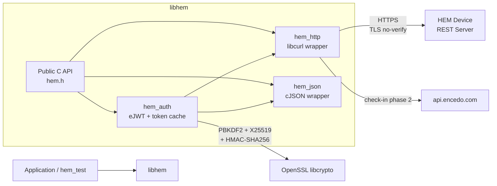

# Architecture: Encedo HEM C Client Library

## [TLDR]

**Purpose:** A C library (`libhem`) that provides a clean, high-level interface to the Encedo HEM (Hardware Encryption Module) REST API, enabling applications to perform cryptographic operations, key management, and device administration without dealing with HTTP, JSON, or the eJWT authentication protocol directly.

**Core components:**
- **libhem** -- Static/shared C library exposing all HEM REST endpoints as C functions, with automatic authentication, session management, and check-in support
- **hem_test** -- MVP test program that exercises the core workflow: status, check-in, key creation, encrypt/decrypt, key deletion

**Technology choices:**
- **Language**: C (C11) -- required by project spec; maximizes portability and embedding into other projects
- **HTTP client**: libcurl -- mature, widely available, handles TLS transparently
- **JSON parsing**: cJSON -- lightweight, single-file, MIT-licensed, widely used in embedded/C projects
- **Crypto (for eJWT auth)**: OpenSSL (libcrypto) -- needed for PBKDF2-SHA256, X25519 key derivation, and HMAC-SHA256 to construct eJWT tokens client-side
- **Build system**: CMake -- cross-platform, good dependency management

**Data flow:**
1. Application calls `hem_*()` functions (e.g., `hem_encrypt()`)
2. Library checks if a valid JWT token exists for the required scope; if not, performs eJWT authentication automatically
3. Library serializes parameters to JSON, makes HTTP request via libcurl with Bearer token
4. Library parses JSON response, returns structured C data to caller

**Key architectural decisions:**
- **Opaque context handle** (`hem_ctx_t`) -- all state (base URL, credentials, cached JWT tokens) lives in a context struct; no globals, single-threaded usage
- **Automatic scope-based auth** -- library tracks JWT expiry and scope, re-authenticates transparently when needed
- **Error model** -- functions return `hem_error_t` enum; detailed error info available via `hem_last_error(ctx)`
- **Memory ownership** -- caller-allocated buffers for output (no hidden mallocs), with size query functions
- **TLS verification disabled** -- certificate validation is skipped; device authenticity is established via the check-in protocol instead
- **Target platform**: Linux (build/test scripts are shell scripts; development happens on Windows but scripts target Linux)
- **Passphrase as string** -- MVP passes passphrase directly as `const char*`; no callback indirection

---

## System Overview



The library follows a **layered architecture** within a single static/shared library:

- **Public API layer** -- one header per domain (`hem_system.h`, `hem_keymgmt.h`, `hem_crypto.h`), all included via a single umbrella `hem.h`
- **Auth layer** -- handles the eJWT challenge-response protocol and caches JWT tokens by scope
- **Transport layer** -- thin libcurl wrapper that handles request construction, TLS settings, and response buffering
- **JSON layer** -- serialization/deserialization helpers wrapping cJSON

---

## Components

### libhem (library)

- **Responsibility:** Translate C function calls into authenticated HEM REST API requests and parse responses into C structs
- **Technology:** C11, libcurl, cJSON (vendored), OpenSSL libcrypto
- **Interfaces:** Public C headers in `include/hem/`
- **Data:** Owns the `hem_ctx_t` context (connection state, credentials, token cache); no persistent storage
- **Scaling strategy:** N/A -- single-threaded, one context per connection

#### Internal modules

| Module | File(s) | Responsibility |
|---|---|---|
| `hem_ctx` | `hem_ctx.c` | Context lifecycle: create, configure, destroy |
| `hem_http` | `hem_http.c` | libcurl wrapper: GET/POST/DELETE, headers, TLS config, response buffer |
| `hem_json` | `hem_json.c` | JSON build/parse helpers, base64 encode/decode utilities |
| `hem_auth` | `hem_auth.c` | eJWT construction (PBKDF2 + X25519 + HMAC-SHA256), token request, token cache with expiry tracking |
| `hem_system` | `hem_system.c` | System endpoints: version, status, checkin, config, reboot |
| `hem_keymgmt` | `hem_keymgmt.c` | Key management: create, derive, import, list, get, update, search, delete |
| `hem_crypto` | `hem_crypto.c` | Crypto ops: HMAC, sign/verify, ECDH, encrypt/decrypt, wrap/unwrap |
| `hem_pqc` | `hem_pqc.c` | Post-quantum: ML-KEM encaps/decaps, ML-DSA sign/verify |
| `hem_logger` | `hem_logger.c` | Audit log: key retrieval, log listing, log download |
| `hem_storage` | `hem_storage.c` | Storage: unlock/lock (PPA only) |

### hem_test (MVP test program)

- **Responsibility:** Demonstrate and verify the core library workflow end-to-end
- **Technology:** C11, links against libhem
- **Flow:**
  1. `hem_system_status()` -- print device status
  2. `hem_system_checkin()` -- perform check-in (GET challenge, POST to backend, POST response to device)
  3. `hem_key_create()` -- create an AES256 key
  4. `hem_encrypt()` -- encrypt a random test message with AES256-GCM
  5. `hem_decrypt()` -- decrypt and verify plaintext matches
  6. `hem_key_delete()` -- remove the test key
- **Exit code:** 0 on success, non-zero with diagnostic output on failure

---

## Data Architecture

### Key entities (C structs)

```c
/* Opaque context -- internal details hidden from callers */
typedef struct hem_ctx hem_ctx_t;

/* Device version info */
typedef struct {
    char hwv[32];    /* Hardware version */
    char blv[32];    /* Bootloader version */
    char fwv[32];    /* Firmware version */
    char fws[65];    /* Firmware signature */
    char uis[65];    /* UI signature */
} hem_version_t;

/* Device status */
typedef struct {
    int      fls_state;     /* Failure state bitmask */
    int64_t  ts;            /* RTC timestamp, -1 if absent */
    char     hostname[128]; /* Device FQDN */
    bool     https;         /* TLS operational */
    bool     initialized;   /* Device is initialized */
    int      uptime;        /* Seconds since boot */
    int      temp;          /* Temperature in Celsius */
} hem_status_t;

/* Key list entry */
typedef struct {
    char    kid[33];       /* 32-char hex key ID + null */
    char    label[32];     /* Key label */
    char    type[64];      /* Comma-separated type string */
    int64_t created;       /* Creation timestamp */
    int64_t updated;       /* Last update timestamp */
} hem_key_info_t;

/* Encryption result */
typedef struct {
    uint8_t *ciphertext;    /* Caller-provided buffer */
    size_t   ciphertext_len;
    uint8_t  iv[16];        /* IV (CBC/GCM) */
    size_t   iv_len;
    uint8_t  tag[16];       /* GCM auth tag */
    size_t   tag_len;
} hem_cipher_result_t;
```

### Internal context state

```c
struct hem_ctx {
    /* Connection */
    char          base_url[256];
    CURL         *curl;

    /* Credentials */
    char          passphrase[256];
    hem_role_t    role;           /* HEM_ROLE_USER or HEM_ROLE_MASTER */

    /* Cached auth state from GET /api/auth/token */
    char          eid[128];       /* Device entity ID (PBKDF2 salt) */
    char          spk[128];       /* Device X25519 public key (base64) */

    /* Token cache -- one active token at a time */
    char          token[2048];    /* Current JWT */
    char          token_scope[128];
    time_t        token_exp;      /* Expiry timestamp */

    /* Error state */
    hem_error_t   last_error;
    int           http_status;
    char          error_msg[256];

    /* HTTP response buffer */
    char         *resp_buf;
    size_t        resp_len;
    size_t        resp_cap;
};
```

### No persistent storage

The library is stateless across process restarts. JWT tokens live only in memory and are re-acquired on each new context.

---

## API Design

### C API style

The public API follows a consistent pattern:

```c
hem_error_t hem_<domain>_<action>(hem_ctx_t *ctx, [input params], [output struct pointer]);
```

All functions return `hem_error_t`. Output is written to caller-provided structs/buffers.

### Core public API (MVP scope)

```c
/* --- Context management --- */
hem_ctx_t  *hem_ctx_create(const char *base_url);
void        hem_ctx_destroy(hem_ctx_t *ctx);
hem_error_t hem_ctx_set_credentials(hem_ctx_t *ctx, const char *passphrase, hem_role_t role);

/* Error inspection */
hem_error_t hem_last_error(const hem_ctx_t *ctx);
int         hem_last_http_status(const hem_ctx_t *ctx);
const char *hem_last_error_msg(const hem_ctx_t *ctx);

/* --- System --- */
hem_error_t hem_system_version(hem_ctx_t *ctx, hem_version_t *out);
hem_error_t hem_system_status(hem_ctx_t *ctx, hem_status_t *out);
hem_error_t hem_system_checkin(hem_ctx_t *ctx);
    /* Internally: GET /api/system/checkin -> POST api.encedo.com/checkin -> POST /api/system/checkin */

/* --- Authentication (called automatically, but exposed for manual use) --- */
hem_error_t hem_auth_login(hem_ctx_t *ctx, const char *scope);

/* --- Key Management --- */
hem_error_t hem_key_create(hem_ctx_t *ctx, const char *label, const char *type,
                           char *kid_out, size_t kid_out_size);
hem_error_t hem_key_delete(hem_ctx_t *ctx, const char *kid);
hem_error_t hem_key_list(hem_ctx_t *ctx, int offset, int limit,
                         hem_key_info_t *list, int list_cap, int *total, int *listed);
hem_error_t hem_key_get(hem_ctx_t *ctx, const char *kid, hem_key_info_t *out);

/* --- Crypto --- */
hem_error_t hem_encrypt(hem_ctx_t *ctx, const char *kid, const char *alg,
                        const uint8_t *plaintext, size_t pt_len,
                        const uint8_t *aad, size_t aad_len,
                        hem_cipher_result_t *result);
hem_error_t hem_decrypt(hem_ctx_t *ctx, const char *kid, const char *alg,
                        const uint8_t *ciphertext, size_t ct_len,
                        const uint8_t *iv, size_t iv_len,
                        const uint8_t *tag, size_t tag_len,
                        const uint8_t *aad, size_t aad_len,
                        uint8_t *plaintext_out, size_t *pt_out_len);
```

### Error enum

```c
typedef enum {
    HEM_OK = 0,
    HEM_ERR_INVALID_ARG,     /* NULL pointer, bad parameter */
    HEM_ERR_HTTP,             /* libcurl transport error */
    HEM_ERR_HTTP_STATUS,      /* Non-200 HTTP response */
    HEM_ERR_JSON,             /* Malformed JSON response */
    HEM_ERR_AUTH,             /* Authentication failed (401/403) */
    HEM_ERR_DEVICE_FAILURE,   /* Device in FLS state (409) */
    HEM_ERR_BUFFER_TOO_SMALL, /* Output buffer insufficient */
    HEM_ERR_OPENSSL,          /* OpenSSL operation failed */
    HEM_ERR_CHECKIN,          /* Check-in backend unreachable or failed */
} hem_error_t;
```

### Authentication flow (internal)

When a function requires auth and no valid cached token exists for the needed scope:

1. `GET /api/auth/token` -- receive `eid`, `spk`, `jti`, `exp`
2. `seed = PBKDF2-SHA256(passphrase, eid, 600000)` (OpenSSL `PKCS5_PBKDF2_HMAC`)
3. `keypair = X25519_keygen(seed)` -- derive user's X25519 keypair from seed
4. `shared = X25519(seed_privkey, device_spk)` -- ECDH with device public key
5. Build eJWT header + payload, sign with `HMAC-SHA256(shared, header.payload)`
6. `POST /api/auth/token {"auth": "<ejwt>"}` -- receive JWT
7. Cache token, scope, and expiry in `hem_ctx_t`

---

## Infrastructure & Deployment

### Project layout

```
test_c_api_claude/
├── CMakeLists.txt              # Top-level build config
├── ARCHITECTURE.md
├── hem-rest-api-design.md      # API reference
├── mvp-description.txt
├── include/
│   └── hem/
│       ├── hem.h               # Umbrella header (includes all below)
│       ├── hem_types.h         # Enums, structs, error codes
│       ├── hem_system.h        # System API declarations
│       ├── hem_keymgmt.h       # Key management API declarations
│       └── hem_crypto.h        # Crypto operations API declarations
├── src/
│   ├── hem_ctx.c               # Context create/destroy/configure
│   ├── hem_http.c              # libcurl transport layer
│   ├── hem_json.c              # JSON + base64 utilities
│   ├── hem_auth.c              # eJWT construction + token management
│   ├── hem_system.c            # System endpoint implementations
│   ├── hem_keymgmt.c           # Key management implementations
│   ├── hem_crypto.c            # Crypto endpoint implementations
│   └── internal.h              # Shared internal declarations
├── third_party/
│   └── cJSON/
│       ├── cJSON.h
│       └── cJSON.c
├── test/
│   └── hem_test.c              # MVP test program
└── scripts/
    ├── build.sh                # cmake + make
    └── test.sh                 # Run hem_test with device params
```

### Build system (CMake)

```cmake
# Dependencies (system-installed)
find_package(CURL REQUIRED)
find_package(OpenSSL REQUIRED)

# Library target
add_library(hem STATIC
    src/hem_ctx.c src/hem_http.c src/hem_json.c src/hem_auth.c
    src/hem_system.c src/hem_keymgmt.c src/hem_crypto.c
    third_party/cJSON/cJSON.c)
target_include_directories(hem PUBLIC include PRIVATE src third_party/cJSON)
target_link_libraries(hem PRIVATE CURL::libcurl OpenSSL::Crypto)

# Test program
add_executable(hem_test test/hem_test.c)
target_link_libraries(hem_test PRIVATE hem)
```

### Build script (`scripts/build.sh`)

```bash
#!/bin/bash
set -e
mkdir -p build && cd build
cmake .. -DCMAKE_BUILD_TYPE=Debug
make -j$(nproc)
```

### Test script (`scripts/test.sh`)

```bash
#!/bin/bash
set -e
# Usage: ./scripts/test.sh <device_url> <passphrase>
# Example: ./scripts/test.sh https://my.ence.do <pass>
./build/hem_test "$@"
```

### Dependencies (Linux)

```bash
# Ubuntu/Debian
apt install libcurl4-openssl-dev libssl-dev cmake build-essential
```

---

## Security Considerations

### Authentication architecture
- Passphrase never sent over the wire -- only used locally to derive X25519 keys via PBKDF2 (600,000 iterations)
- JWT tokens are short-lived and scoped to specific operations
- All crypto key material stays on the HSM; the library only handles encrypted data and key IDs

### Data protection
- HTTPS transport to device (TLS 1.3)
- TLS certificate verification is **disabled** in MVP -- device authenticity relies on the check-in protocol which verifies the device against the Encedo backend
- Passphrase is stored in-memory in the context struct; zeroed on `hem_ctx_destroy()`

### Key threats and mitigations

| Threat | Mitigation |
|---|---|
| Passphrase in memory | Zeroed in `hem_ctx_destroy()`; single-threaded so no concurrent access |
| MITM on device connection | Check-in validates device with Encedo backend; future: enable TLS cert verification |
| JWT token theft | Tokens are short-lived, scoped, and memory-only |
| POST body size limit (7300 bytes) | Library validates payload size before sending; returns `HEM_ERR_INVALID_ARG` |

---

## Implementation Plan

### Phase 1: Project skeleton + HTTP/JSON infrastructure (~2-3 days)

**Goal:** Build compiles, libcurl can talk to a device, unauthenticated endpoints work

**Tasks:**
- [ ] Create directory structure, CMakeLists.txt, build.sh
- [ ] Vendor cJSON (copy cJSON.c + cJSON.h into third_party/)
- [ ] Implement `hem_ctx` -- create, destroy, set base URL
- [ ] Implement `hem_http` -- GET/POST/DELETE with libcurl, response buffering, TLS no-verify
- [ ] Implement `hem_json` -- parse/build helpers, base64 encode/decode
- [ ] Implement `hem_system_version()` and `hem_system_status()` (no auth required)
- [ ] Minimal test program that prints version + status

**Deliverable:** `hem_test` connects to a real device and prints version/status info

**Dependencies:** Linux machine with libcurl, OpenSSL, cmake installed; reachable HEM device

### Phase 2: eJWT authentication (~2-3 days)

**Goal:** Library can authenticate as User or Master and obtain scoped JWT tokens

**Tasks:**
- [ ] Implement PBKDF2-SHA256 key derivation using OpenSSL
- [ ] Implement X25519 keypair generation from seed
- [ ] Implement X25519 ECDH shared secret computation
- [ ] Implement eJWT construction (header + payload + HMAC-SHA256 signature)
- [ ] Implement base64url encoding for JWT segments
- [ ] Implement `hem_auth_login(ctx, scope)` -- full challenge-response flow
- [ ] Implement token caching with expiry checking in context
- [ ] Test: authenticate and call `GET /api/system/config` (requires auth)

**Deliverable:** Library can log in and make authenticated API calls

**Dependencies:** Phase 1 complete; device passphrase known

### Phase 3: Check-in + key management + crypto (~2-3 days)

**Goal:** All MVP operations work end-to-end

**Tasks:**
- [ ] Implement `hem_system_checkin()` -- two-phase flow via Encedo backend
- [ ] Implement `hem_key_create()`, `hem_key_delete()`, `hem_key_list()`
- [ ] Implement `hem_encrypt()` and `hem_decrypt()` (AES-GCM focus)
- [ ] Automatic re-authentication when scope changes (e.g., `keymgmt:gen` -> `keymgmt:use:<kid>`)

**Deliverable:** All six MVP test steps pass against a real device

**Dependencies:** Phase 2 complete; device is initialized

### Phase 4: MVP test program + polish (~1-2 days)

**Goal:** Clean, self-contained test program with clear output and error handling

**Tasks:**
- [ ] Write `hem_test.c` with full MVP flow (status, checkin, create key, encrypt, decrypt, delete key)
- [ ] Add clear step-by-step console output with pass/fail indicators
- [ ] Handle and report all error conditions gracefully
- [ ] Write `scripts/test.sh`
- [ ] End-to-end test against real device

**Deliverable:** Running `./scripts/test.sh https://device.url passphrase` executes the full MVP and reports success/failure

**Dependencies:** Phase 3 complete

### Phase 5: Full API coverage (post-MVP)

**Goal:** All HEM REST endpoints exposed via the C library

**Tasks:**
- [ ] Remaining system endpoints: config (GET/POST), reboot, shutdown, selftest, attestation
- [ ] Remaining key management: derive, import, update, search
- [ ] Remaining crypto: HMAC hash/verify, ExDSA sign/verify, ECDH, key wrap/unwrap
- [ ] Post-quantum: ML-KEM encaps/decaps, ML-DSA sign/verify
- [ ] Audit log: key, list, download
- [ ] Storage: unlock/lock
- [ ] External authentication flow (ext/init, ext/validate, ext/request, ext/token)

**Deliverable:** Complete `libhem` with all HEM API endpoints

**Dependencies:** Phase 4 complete (MVP validated on real hardware)

---

## Risks & Mitigations

| Risk | Impact | Likelihood | Mitigation |
|---|---|---|---|
| eJWT implementation doesn't match device expectations | H | M | Follow the spec precisely; test auth in isolation before building on top |
| POST body exceeds 7300-byte device limit | M | L | Library checks payload size; large data operations aren't part of MVP |
| Device not reachable during development | H | M | Test HTTP/JSON layers with mock responses; validate against real device periodically |
| OpenSSL API differences across versions | M | L | Target OpenSSL 1.1.1+ API; avoid deprecated functions |
| Base64url vs standard base64 confusion in eJWT | H | M | Separate base64url helpers specifically for JWT; standard base64 for API payloads |

---

## Decision Log

| Decision | Rationale | Alternatives Considered | Date |
|---|---|---|---|
| C11 language standard | Needed for `<stdint.h>`, `<stdbool.h>`, widely supported | C99 (lacks some features), C17 (no practical difference) | 2026-04-03 |
| cJSON for JSON parsing | Single-file, MIT license, zero dependencies, mature | json-c (heavier), Jansson (requires install), hand-rolled (error-prone) | 2026-04-03 |
| Vendor cJSON in-tree | Avoids system dependency for a single .c/.h file | System package (complicates build for one file) | 2026-04-03 |
| Static library default | Simpler deployment, no runtime dependency issues | Shared library (add as CMake option later if needed) | 2026-04-03 |
| Single token cache (one scope at a time) | Matches MVP single-threaded, sequential usage | Multi-scope cache (over-engineering for MVP) | 2026-04-03 |
| Skip TLS verification | Device authenticity via check-in; avoids certificate management complexity in MVP | Full verification (requires provisioned TLS certs and CA trust) | 2026-04-03 |
| Caller-allocated output buffers | No hidden mallocs, predictable memory usage, C-idiomatic | Library-allocated with free functions (more convenient but less predictable) | 2026-04-03 |
